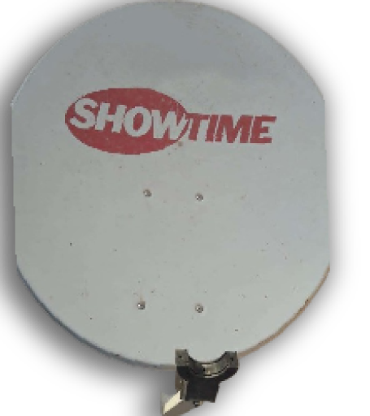
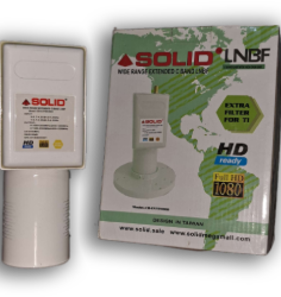

# Portifiillo Website Readme

Welcome to the documentation for the impressive Portifiillo website. This website showcases the professional portfolio of Hameed Satalaite, a talented individual with expertise in satellite television systems. The website is designed with a modern and visually appealing interface, providing a glimpse into Hameed's collaboration with Fracarro and his outstanding contributions to the field. Let's dive into the details!

## Table of Contents

1. [Introduction](#introduction)
2. [Key Features](#key-features)
3. [Usage](#usage)
4. [Collaboration with Fracarro](#collaboration-with-fracarro)
5. [Product Offerings](#product-offerings)
6. [Subscription and Maintenance](#subscription-and-maintenance)
7. [Contact Information](#contact-information)
8. [Dish Systems](#dish-systems)
9. [C-Band System](#c-band-system)
10. [Korean and Foreign Channels](#korean-and-foreign-channels)
11. [Development and Updates](#development-and-updates)
12. [Call to Action](#call-to-action)
13. [How to Purchase](#how-to-purchase)
14. [Image Gallery](#image-gallery)
15. [Contact Hameed](#contact-hameed)

## Introduction

The Portifiillo website is an interactive platform that introduces Hameed Satalaite and his exceptional work in the field of satellite television systems. The website is not only visually appealing but also informative, offering insights into Hameed's collaborations, products, and services.

## Key Features

- Modern and Responsive Design
- Collaboration Highlights with Fracarro
- Showcase of Satellite Dish Systems
- Subscription and Maintenance Information
- Contact Details for Inquiries

## Usage

To explore the website, simply open the [index.html](index.html) file in your web browser. Navigate through the sections to discover Hameed's expertise and achievements.

## Collaboration with Fracarro

Hameed's collaboration with Fracarro is a testament to his commitment to excellence. The website provides details on the joint efforts in designing and implementing centralized satellite television systems in Dubai.

## Product Offerings

Explore Hameed's portfolio of products, including premium satellite dish systems. Each system is crafted with precision and offers a unique viewing experience.

## Subscription and Maintenance

Learn about the subscription plans for Bn Sport and the maintenance services offered by Hameed. Stay connected to your favorite channels hassle-free.

## Contact Information

For inquiries and further information, reach out to Hameed through the following channels:

- **Asia Cell**: 07705752109
- **Iraqna**: 07901391930

## Dish Systems

Discover top-quality satellite dish systems, meticulously designed to deliver an exceptional TV viewing experience.

## C-Band System

Introducing the C-Band System, priced at $30. Experience unparalleled signal quality with this premium satellite system.

## Korean and Foreign Channels

Explore a diverse range of Korean and foreign channels, made possible through collaboration with Fracarro. Enjoy 80 channels, with an additional 10 stations developed in partnership.

## Development and Updates

Stay informed about the latest developments and updates. Hameed is dedicated to enhancing the user experience and regularly adds new features and channels.

## Call to Action

"ماذا تنتظر؟" (What are you waiting for?) Visit the Portifiillo website now and explore the world of satellite television systems.

## How to Purchase

Ready to make a purchase? "اشتري الان!" (Buy now!) Simply visit the website and follow the easy steps to acquire the latest satellite dish systems.

## Image Gallery

Take a visual tour of Hameed's work by exploring the image gallery on the website.

## Contact Hameed

For direct communication, feel free to reach out to Hameed via [WhatsApp](https://wa.me/+9467901391930).

Thank you for visiting the Portifiillo website! Experience the future of satellite television with Hameed Satalaite.
